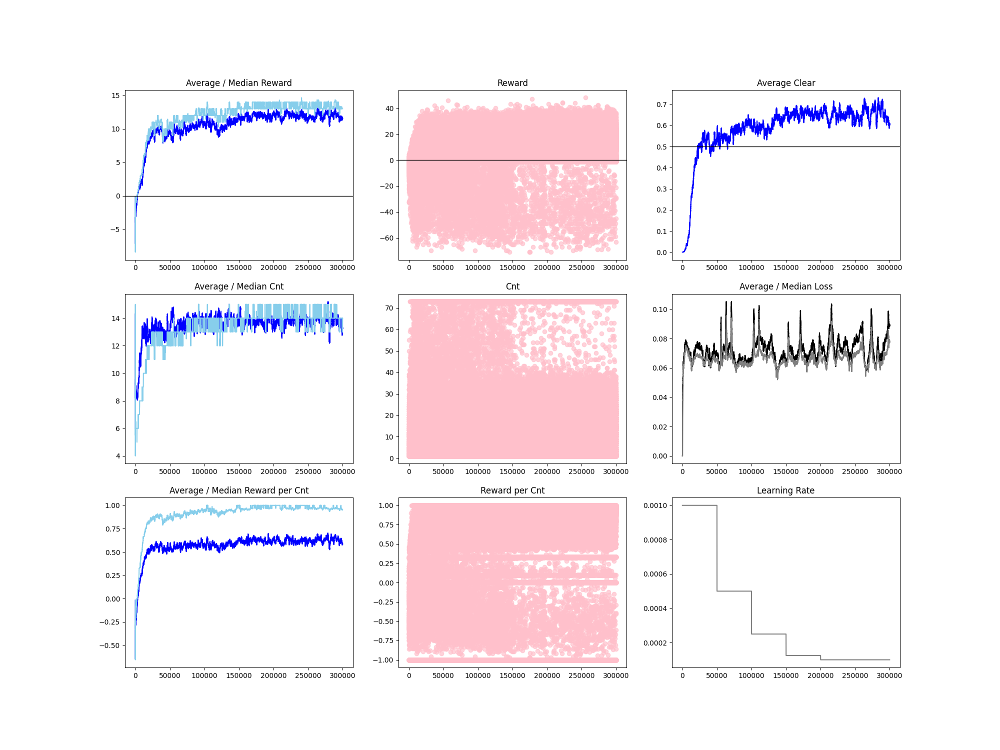

## Minesweeper (DQN)
> DQN(Deep Q-Network)으로 지뢰찾기 게임을 스스로 클리어하는 에이전트를 학습시킨 강화학습 프로젝트.
> 동아리 팀프로젝트로 시작한 코드의 버그와 구조적 한계를 직접 고치고, 결과에 통계적 근거까지 갖추기 위해 개인적으로 리팩토링·디벨롭했다.
> 최종 모델(A2)이 승률 72.1%로 다른 두 비교 모델보다 통계적으로 유의하게 우수함을 확인해 최종 선정했다.

**나의 역할**: 팀 프로젝트로 시작된 코드를 이후 개인적으로 리팩토링·개선함
**배운 점**: 버그를 고치는 것만으로는 부족하고, 고쳤다는 근거를 통계적으로 검증해야 신뢰할 수 있는 결론이 된다는 것. 그리고 실험 폴더명·설정 기록 같은 관리가 허술하면 나중에 결과를 오독하기 쉽다는 것을 배움.

`#Python` `#PyTorch` `#DQN` `#강화학습` `#CNN` `#R통계분석` `#리팩토링` `#재현성`
