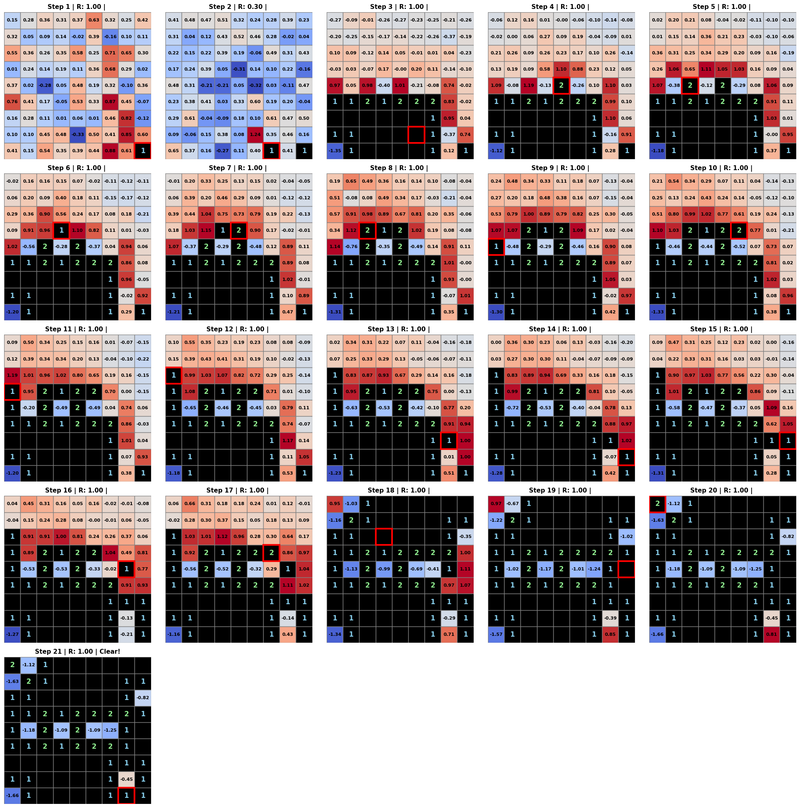

## Minesweeper (DQN)
> CNN 기반 DQN(Deep Q-Network)으로 지뢰찾기 게임을 해결하는 에이전트를 설계·학습시킨 강화학습 프로젝트.
> 동아리 팀 프로젝트로 시작된 코드의 경계 조건 버그와 학습 재개 결함을 직접 진단해 고치고, 실험을 재현 가능하게 관리할 수 있는 구조(Trainer/Tester 클래스, config 자동 기록)로 새로 설계했다.
> 지뢰 개수 7~12개 조건에서 총 18만 판을 반복 테스트하고 R로 카이제곱·t검정을 수행해, 최종 모델이 승률 72.1%로 비교 모델 대비 통계적으로 유의하게 우수함을 검증했다.

에이전트가 첫 번째, 두 번째 수에서 거의 정보를 얻지 못해 불리한 게임이었음에도 21수 만에 완전 클리어까지 이어간 실제 플레이 기록:

### 주요 내용
- 학습 루프를 `Trainer`/`Tester`/`Log` 클래스로 분리하고, 하이퍼파라미터·경로를 `config.py` 한 곳에서 관리하며 실험마다 자동 기록되도록 재설계하였다.
- guess 판정 경계 조건 오류, 카운트 제한값 오류 등 이전 코드의 실제 버그를 코드 레벨에서 진단해 수정하였다.
- 지뢰 개수·첫 클릭 허용 여부를 실험 변수로 설정해 3개 모델(A1/A2/B)을 설계하고, 조건별 10,000판씩 반복 테스트해 데이터를 확보하였다.
- R로 카이제곱·t검정·분산검정을 수행해 모델의 성능을 통계적으로 검증하였다.
- 모델 학습 시 하이퍼파라미터 정보를 담고있는 'config' 파일 관리 실수로 발생한 'dqn_modelA_400k' 모델을 확인하고 삭제하였다.

### 배운 점 및 인사이트
- 첫 수에서 지뢰를 선택할 위험을 제거한 환경(B)이 오히려 더 낮은 성능을 보이는 반직관적 결과를 확인했다.
- 이전 프로젝트(중복 행동 방지)에서 하드코딩보다 보상 설계로 학습하게 했을 때 성능이 더 좋았던 경험을 떠올려, '제약이 적고 정보가 단순한 환경일수록 더 풍부한 학습 신호를 준다'는 가설을 세우고 이번 A1-B 비교에서 통계적으로 검증했다. 여러 프로젝트를 거치며 이 원칙이 반복적으로 확인되고 있다.
- 불리한 상황에서 모델의 적응력을 검증하기 위해 '두 번째 턴 조기 패배율'을 이론적 확률과 비교했고, 모델의 확률적 판단력까지 정량적으로 확인했다.

`#Python` `#PyTorch` `#DQN` `#강화학습` `#통계적가설검증` `#반직관적결과분석` `#실험재현성` `#디버깅`